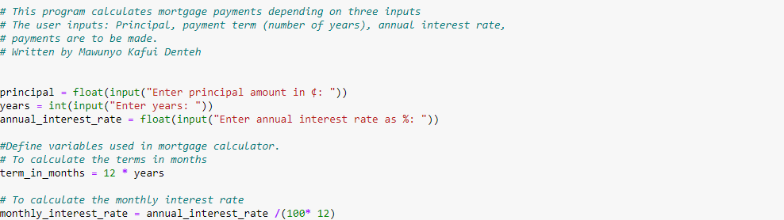
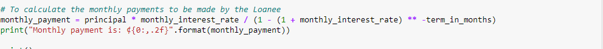
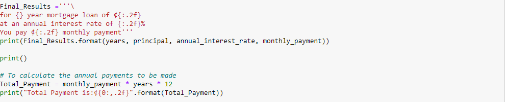

# Simple-Mortgage-Calculator
Creating a simple mortgage calculator

## Basic steps of creating a simple mortgage calculator

1. The initial codes of this program seeks to direct you on how to input the principal, years and the interest rate being charged.

    

2. This code seeks to calculate the monthly payment made by a loanee

   

3. This final code will help display the annual payments expected to be made by the loanee
 